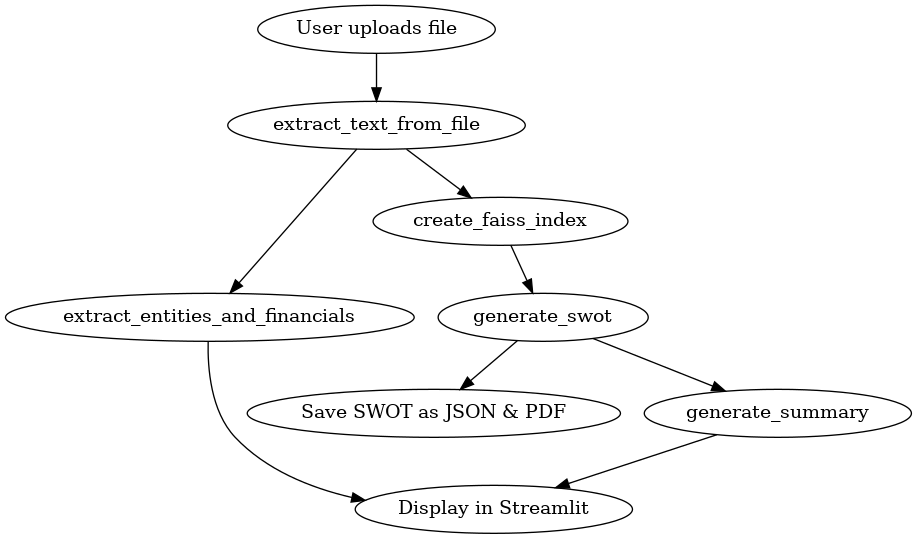

flowchart TD
    A[User uploads file] --> B[extract_text_from_file]
    B --> C[extract_entities_and_financials]
    B --> D[create_faiss_index]
    D --> E[generate_swot]
    E --> F[Save SWOT as JSON & PDF]
    E --> G[generate_summary]
    G --> H[Display in Streamlit]
    C --> H
    