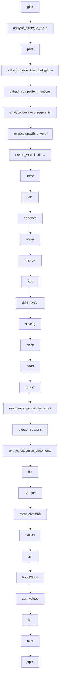

```mermaid
flowchart TD
    A0[glob] --> A1[analyze_strategic_focus]
    A1[analyze_strategic_focus] --> A2[print]
    A2[print] --> A3[extract_competitive_intelligence]
    A3[extract_competitive_intelligence] --> A4[extract_competitor_mentions]
    A4[extract_competitor_mentions] --> A5[analyze_business_segments]
    A5[analyze_business_segments] --> A6[extract_growth_drivers]
    A6[extract_growth_drivers] --> A7[create_visualizations]
    A7[create_visualizations] --> A8[items]
    A8[items] --> A9[join]
    A9[join] --> A10[generate]
    A10[generate] --> A11[figure]
    A11[figure] --> A12[imshow]
    A12[imshow] --> A13[axis]
    A13[axis] --> A14[tight_layout]
    A14[tight_layout] --> A15[savefig]
    A15[savefig] --> A16[close]
    A16[close] --> A17[head]
    A17[head] --> A18[to_csv]
    A18[to_csv] --> A19[read_earnings_call_transcript]
    A19[read_earnings_call_transcript] --> A20[extract_sections]
    A20[extract_sections] --> A21[extract_executive_statements]
    A21[extract_executive_statements] --> A22[nlp]
    A22[nlp] --> A23[Counter]
    A23[Counter] --> A24[most_common]
    A24[most_common] --> A25[values]
    A25[values] --> A26[get]
    A26[get] --> A27[WordCloud]
    A27[WordCloud] --> A28[sort_values]
    A28[sort_values] --> A29[len]
    A29[len] --> A30[sum]
    A30[sum] --> A31[split]
    A31[split]
```